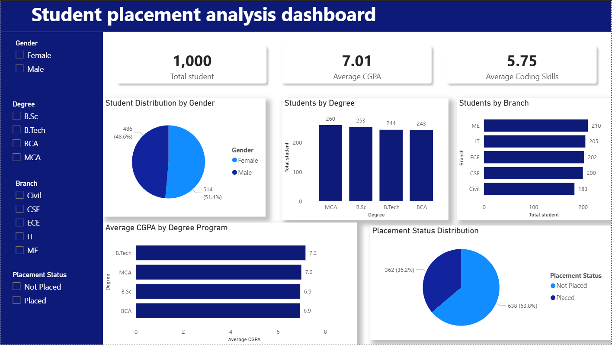

# Student-Placement-Analysis-Dashboard
Interactive Power BI dashboard for analyzing student placement trends, CGPA, coding skills, and branch-wise performance.
# Student Placement Analysis Dashboard

This project focuses on analyzing student placement data using Excel, Python, SQL, and Power BI.

The goal of this project is to understand the factors that influence student placements and identify trends based on CGPA, projects, certifications, coding skills, communication skills, and academic background.

## Tools Used

- Excel
- Python (Pandas, NumPy, Matplotlib)
- SQL (MySQL)
- Power BI

## Project Workflow

1. Data cleaning and preprocessing in Excel
2. Data analysis using Python
3. SQL queries for business insights
4. Interactive dashboard creation in Power BI

## Key Insights

- Students with more projects had higher placement rates.
- Certifications showed a strong impact on placement chances.
- Higher CGPA students were more likely to be placed.
- Coding and communication skills played an important role in placements.
- Placement rates varied across different branches and degrees.

## Files Included

- College to Career Bridge.csv
- college_to_career_bridge.py
- College to Career Bridge India.sql
- Student Placement Analysis Dashboard.pbix
- dashboard.png

## Dashboard Preview

## Author

Parth Taywade 
Aspiring Data Analyst
